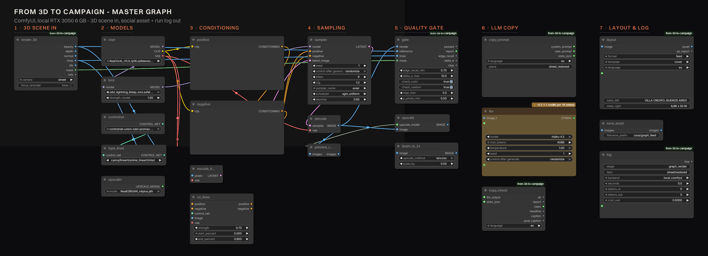
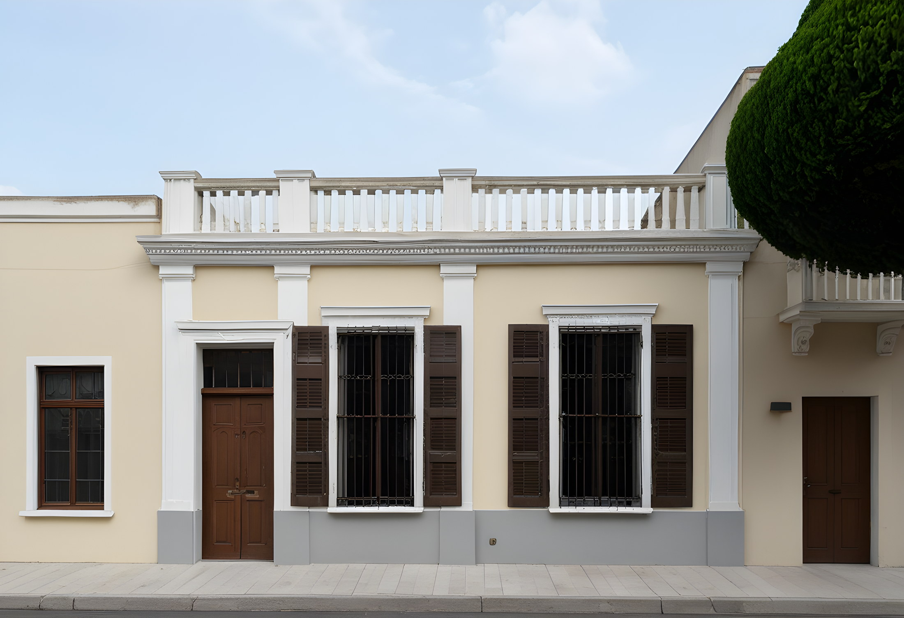
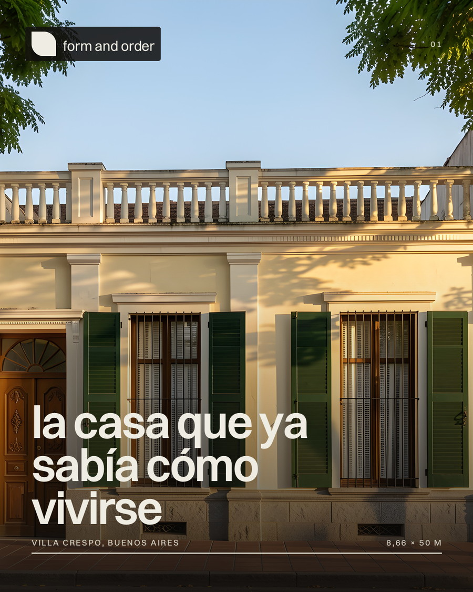
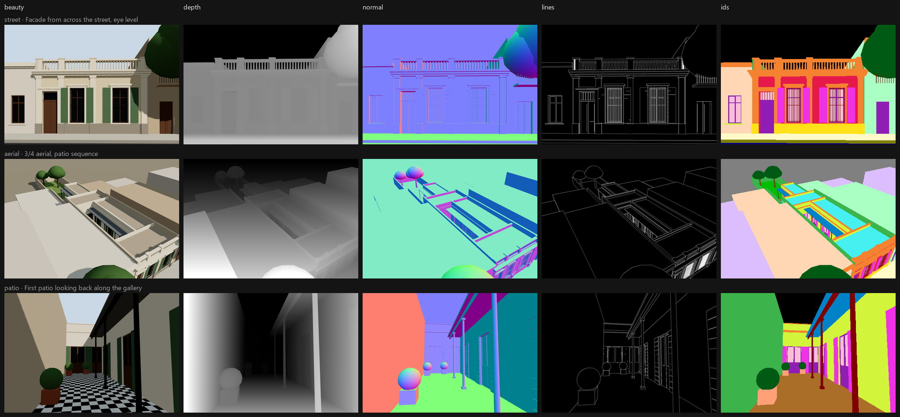
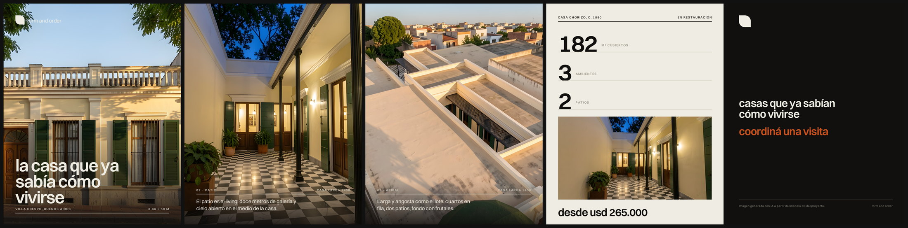
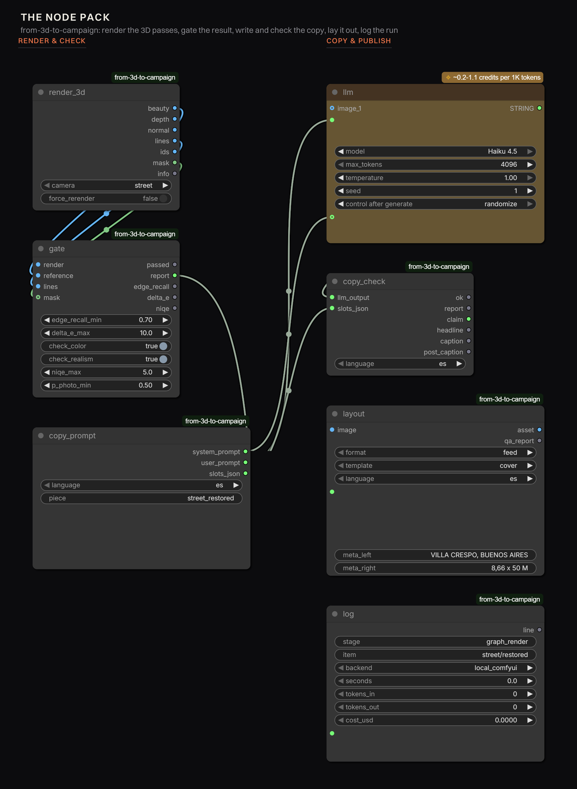

# From 3D to Campaign

Turn the 3D model of a building into a library of social-ready campaign assets — stills, copy,
formats and languages — with a quality gate that protects the architecture and a cost line for
every piece. It runs as **one ComfyUI graph**.



> **Everything in the examples is hypothetical.** The developer *form and order*, the project
> *Casa Larga 1408* and its figures are invented for this R&D. No real brand, listing or company is
> represented, and every generated asset carries an AI disclosure.

**Full write-up:** [`docs/report/index.html`](docs/report/index.html) — the case study, with the
benchmarks, the metrics that failed, and the cost model.

---

## What it does

A developer marketing a building has one 3D model and needs fifty pieces of content: the street
shot, the patio at dusk, the aerial, each cropped for feed, story and link, in every language the
audience speaks, with copy that does not invent a second bathroom.

Prompting an image model is fast and produces a building that does not exist — which, in real
estate, is not a style problem but a legal one. So this pipeline does the opposite: it drives the
generative models with signals taken from the geometry itself, and then **measures the result
against that same geometry** before anything reaches a layout.

| Stage | What happens |
|---|---|
| **1 · 3D scene in** | The house is a data spec in metres. The renderer emits beauty, depth, normals, a material-ID map and a line map. Content-hash cached. |
| **2 · Render** | SDXL + ControlNet locally, or a reference-edit model in the cloud. The beauty pass is the starting latent; the line pass drives ControlNet. |
| **3 · Quality gate** | Edge recall against the 3D lines, ΔE after white balance, NIQE, CLIP photo-vs-CG. Fail → new seed → prompt fix → human review. |
| **4 · Library** | 4× Real-ESRGAN down to 2×, plus crops framed on the building using the ID mask. |
| **5 · Copy** | An LLM with a fact whitelist and per-slot character limits, then a validator with a repair loop. |
| **6 · Layout** | A design system in code: 12-column grid, type scale, safe zones, brand mark, stamped AI disclosure — with its own contrast and collision QA. |
| **7 · Log** | One line per run in `out/runs.jsonl`: seconds, cache hits, tokens, credits, dollars. |

<table>
<tr>
<td width="50%"></td>
<td width="50%"></td>
</tr>
<tr>
<td><sub>Output of the graph, starting from the 3D scene: gate PASS — edge recall 0.882, ΔE 1.5, NIQE 4.37, 133 s on a 6 GB laptop GPU.</sub></td>
<td><sub>The same image after the layout stage: claim, meta row, brand lockup and the AI disclosure, placed by the design system.</sub></td>
</tr>
</table>

---

## How it works

### The 3D scene is data, not a file

`scene/house.json` describes the building in metres — lot, rooms, galleries, patios, facade
openings, cornice, balustrade — and `scene/src/` turns it into geometry. Every mesh carries a
semantic material key, and that key feeds both the look and the material-ID pass.

That is what makes the control signals possible:

| Pass | How it is made | Used for |
|---|---|---|
| `beauty.png` | Shadows, ACES tone mapping | Reference image, starting latent, before/after |
| `depth.png` + `.npy` | Linear view depth → disparity (MiDaS convention), per-camera range | Depth ControlNet, geometry scoring |
| `normal.png` | View-space normals | Normal ControlNet, line reconstruction |
| `lines.png` | G-buffer discontinuities: ID change, relative depth jump, normal crease ≥ 35°, 2× supersampled | Lineart ControlNet, edge recall |
| `ids.png` | Flat semantic colours, no anti-aliasing | Masks for QA, ID-framed crops |

Lines come from the geometry, not from Canny on the beauty, so textures, shadows and foliage never
produce a false edge. Cameras use a **vertical lens shift** instead of tilting, so verticals stay
vertical the way architectural photography does it.



### Lines alone are not enough control

Driven by a line ControlNet only, SDXL kept the facade's rhythm and **invented a second storey with
a balcony** — edge recall 0.51–0.63, three of three rejected by the gate. A line map is a silhouette
plus creases; nothing in it says how tall the building is. What fixes volume is depth, or the beauty
pass itself as a starting latent (denoise 0.85) or as a reference image. With that: edge recall
0.79–0.88, gate PASS.

### The quality gate

Four metrics, thresholds in `config/qa.json` so the gate is configuration, not code:

| Metric | Question | What we learned |
|---|---|---|
| **Edge recall** vs the 3D line map (±2 px, inside the house mask) | Is this the same building? | Works. Catches drift and invented openings. There is a ceiling — the beauty pass scores 0.78 against its own lines — so the threshold sits at 0.70. |
| **ΔE** (CIE76, Lab) after gray-world white balance | Is this the brand's palette? | Works with caveats: needs a coverage floor (on the aerial the facade is 0.37 % of the frame) and a looser threshold at dusk. |
| **NIQE** (pyiqa) | Does it read as a photograph? | The best photo-vs-CG separator: 3D beauty 9.8, local img2img 3.5–5.8, cloud edit ~2.9, text-to-image ~2. |
| **CLIP** zero-shot photo vs render | Same, cheaply | Saturated (0.97–0.99). Kept as a coarse filter. |

Fidelity and realism pull in opposite directions — the settings with the best geometry read most
like CG — which is exactly why there are two thresholds and not one score.

### Copy that cannot invent a fact

The system prompt is built from the brand voice plus a **fact whitelist**: *you may use these
numbers and nothing else; if a fact is not in this list, it does not exist.* Each slot carries a
character limit, because a headline is a layout constraint. The validator parses the JSON, enforces
the limits, rejects banned phrases and any number that is not in the project data, and sends a
repair call with the issue list when something fails — far cheaper than regenerating.

It earned its place on day one: the first run was rejected in all three languages because the prompt
showed the JSON *schema* as if it were the object to return. The validator caught it as "expected a
string, got dict" — a prompt bug that looked exactly like a model bug.

### Layout is part of the pipeline

`pipeline/design.py` is a design system in code — 12-column grid, 9 px baseline, a type scale with
its own tracking and leading, platform-UI safe zones, a brand mark drawn from code. Every text block
is checked for WCAG contrast against the pixels actually behind it, for minimum size, and for
collisions with other blocks. The AI disclosure is stamped by the layout engine in the asset's
language, not left to whoever writes the caption.



### Everything is measured

Each stage appends to `out/runs.jsonl` — seconds, cache hit or miss, tokens, credits, dollars — and
`pipeline/cost_table.py` generates [`docs/costs.md`](docs/costs.md) from it. Nothing is estimated
after the fact. The whole project, every benchmark and rejected render included, cost **$0.145**;
per approved piece, **$0.021**.

---

## Install

### As a ComfyUI node pack

Published on the [ComfyUI Registry](https://registry.comfy.org/nodes/from-3d-to-campaign): open the
**ComfyUI Manager**, search **From 3D to Campaign**, install. Or clone it yourself:

```bash
cd ComfyUI/custom_nodes
git clone https://github.com/meryboth/from-3d-to-campaign
cd from-3d-to-campaign
npm install                     # the Three.js scene + headless exporter
```

Restart ComfyUI. Seven nodes appear under **from 3d to campaign**.

The realism metrics are optional and are *not* declared as dependencies, because both packages pull
their own torch build and would replace the CUDA one ComfyUI runs on. To enable them:

```bash
<ComfyUI-python> -m pip install --no-deps open_clip_torch pyiqa
```

Without them the gate still runs the geometry and colour checks and says `realism skipped` in its
report.

### Models

Nothing downloads models for you — provenance is the user's choice. All four are commercial-use
licences:

| File | Folder | Licence |
|---|---|---|
| RealVisXL V5.0 fp16 | `models/checkpoints` | openrail++ |
| SDXL-Lightning 8-step LoRA | `models/loras` | openrail++ |
| ControlNet Union SDXL Promax (xinsir) | `models/controlnet` | Apache 2.0 |
| RealESRGAN x4plus | `models/upscale_models` | BSD-3 |

### As a standalone pipeline

```bash
git clone https://github.com/meryboth/from-3d-to-campaign && cd from-3d-to-campaign
npm install
python -m venv .venv && .venv/Scripts/pip install -r requirements-dev.txt
```

Headless rendering uses the system's Microsoft Edge through `playwright-core`, so no browser is
downloaded.

---

## Run it

**In ComfyUI:** load `workflows/ui/casa-master.json` from the sidebar and press Run. The graph
renders the 3D passes, generates, gates, upscales, writes and validates the copy, lays out the asset
and appends a line to the run log.

**From the command line:**

```bash
npm run export                        # all cameras -> out/passes (cached)
npm run export -- street              # one camera
npm run scene                         # interactive preview: /?cam=street, press "p" to log the pose

python pipeline/render.py --camera street --style restored --gate 3
python pipeline/post.py --post casa-larga-1408 --langs es en pt
python pipeline/cost_table.py         # regenerates docs/costs.md
python scripts/report_assets.py       # rebuilds the case-study figures
```

### Point it at your own building

Everything the pipeline knows about a project is configuration:

| File | What it holds |
|---|---|
| `scene/house.json` | The building in metres |
| `config/cameras.json` | Cameras, lens shift, depth ranges, output size |
| `config/brand.json` | Palette, typeface, voice, formats, AI disclosure per language |
| `config/copy.json` | The fact whitelist — the only numbers the LLM may use |
| `config/styles.json` | Subjects and styles per camera |
| `config/qa.json` | Every gate threshold, with per-style overrides |
| `config/design.json` | Grid, type scale, safe zones |

---

## The nodes

| Node | In → out |
|---|---|
| `CasaRender3D` | camera → beauty, depth, normal, lines, ids, mask, info |
| `CasaPasses` | normal (+ mask) → line map, for graphs that start from `Load3D` or an external normal pass |
| `CasaQAGate` | render, reference, lines, mask → passed, report, edge recall, ΔE, NIQE |
| `CasaCopySpec` | language, piece → system prompt, user prompt, slots JSON |
| `CasaCopyCheck` | LLM output, slots → ok, report, claim, headline, caption, post caption |
| `CasaLayout` | image, copy → the laid-out asset + a design-QA report |
| `CasaLogRun` | stage, item, seconds, tokens, cost → one line in `runs.jsonl` |



They are thin on purpose: each calls the same `pipeline/` module the CLI uses.

A note on `Load3D`: it looks like the obvious way to bring a GLB into a graph and it does not work
here — it renders in the browser frontend, so a headless or queued run produces nothing. Hence
`CasaRender3D`, which shells out to the same Playwright exporter.

A note on partner API nodes (the LLM): ComfyUI attaches the auth token in the frontend, and they
bill against a **pay-as-you-go credit balance, separate from a Cloud plan**. A prompt queued straight
against the HTTP API comes back *Unauthorized* even when you are signed in. Run those from the app
window, or swap in any other LLM node — the prompt builder and the validator do not care which model
answers, as long as it returns the JSON object.

---

## Repo layout

```
scene/            house.json + the Three.js builder and pass renderer
scripts/          headless exporters (passes, GLB) and the report figure tools
pipeline/         render, qa, realism, gate, library, post, design, cost table, comfy client
comfy_nodes/      the ComfyUI node pack (thin wrappers over pipeline/)
config/           cameras, brand, styles, copy facts, qa thresholds, design tokens
workflows/        api/ and ui/ ComfyUI graphs, including the master graph
docs/             the case study, the lab journal, the cost table
out/              renders, passes, library, posts, runs.jsonl   (git-ignored)
```

---

## Publishing to the Comfy Registry

Published as **`from-3d-to-campaign`** under the publisher **`@meryboth`**. Releases are automatic:
bump `version` in `pyproject.toml`, push to `main`, and `.github/workflows/publish_action.yml` does
the rest. A new version lands as *pending* while the registry scans it, then goes active.

To reproduce the setup on another repo:

1. Create a publisher at [registry.comfy.org](https://registry.comfy.org). The handle after the `@`
   is your **PublisherId** and it is permanent — it must match `[tool.comfy] PublisherId` in
   `pyproject.toml`.
2. Create an API key on the publisher's page and store it once; it cannot be retrieved later.
3. Add it to the repo as the secret `REGISTRY_ACCESS_TOKEN`
   (Settings → Secrets and variables → Actions).
4. Publish — either `pip install comfy-cli && comfy node publish`, or bump `version` in
   `pyproject.toml` and push.

If the action fails with `Option '--token' requires an argument`, the secret is missing or misnamed:
that is what an empty `REGISTRY_ACCESS_TOKEN` looks like from inside the runner.

Still worth doing before calling it stable: node-level CI (load the pack headless, run the graph on
a fixture scene, assert the gate's numbers against stored values), a model bootstrap script with
checksums, and removing the Node.js requirement for users who bring their own GLB.

---

## Rights

- **Models:** RealVisXL V5 (openrail++), xinsir ControlNet Union (Apache 2.0), Real-ESRGAN (BSD-3),
  Z-Image Turbo + Fun ControlNet (Apache 2.0), FLUX.2 klein (Apache 2.0). 4x-UltraSharp
  (CC BY-NC-SA) and FLUX.1-dev (non-commercial) were deliberately avoided.
- **Typeface:** Switzer, Fontshare licence, commercial use allowed.
- **Brand:** the mark is drawn from code; the visual language is generic modernist; the developer and
  the project are invented.
- **Disclosure:** every asset carries "image generated with AI from the project's 3D model" in its
  own language, stamped by the layout engine.
- **The real risk in real estate is misrepresentation.** An image that adds a balcony is a legal
  problem, not an aesthetic one. That is what the geometry check is for, and why borderline images go
  to a review queue with the reason recorded next to them.

Code: MIT ([`LICENSE`](LICENSE)).

---

## Limitations

- Gate thresholds are calibrated by eye on ~30 images; they need a VLM judge or human labels to be
  defensible at scale.
- The aerial camera is the weakest case: the facade is 0.37 % of the frame, so colour QA there is
  skipped by a coverage floor.
- Custom nodes run on local ComfyUI. Comfy Cloud executes its own catalogue, so cloud runs use stock
  nodes and the gate runs afterwards, locally.
- The local tier's light is flatter than the cloud edit model's (NIQE 4.2–4.4 vs ~2.9). Good enough
  for drafts, not for the hero image.
- Video is untested. Next experiment: a reels clip from the same passes, with the gate applied per
  frame.

## Docs

- [`docs/report/index.html`](docs/report/index.html) — the case study
- [`docs/journal.md`](docs/journal.md) — the lab journal: decisions, numbers, what broke
- [`docs/report-notes.md`](docs/report-notes.md) — the working notes behind the case study
- [`docs/costs.md`](docs/costs.md) — generated cost table
