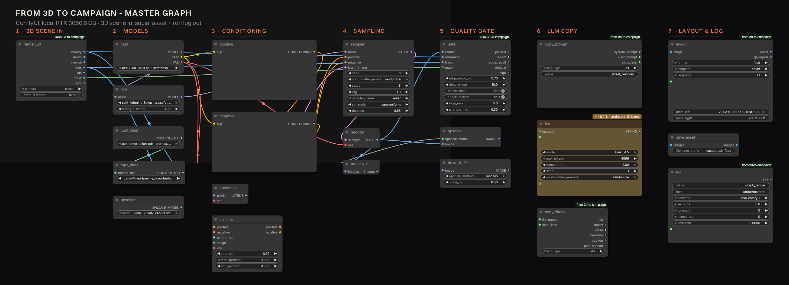
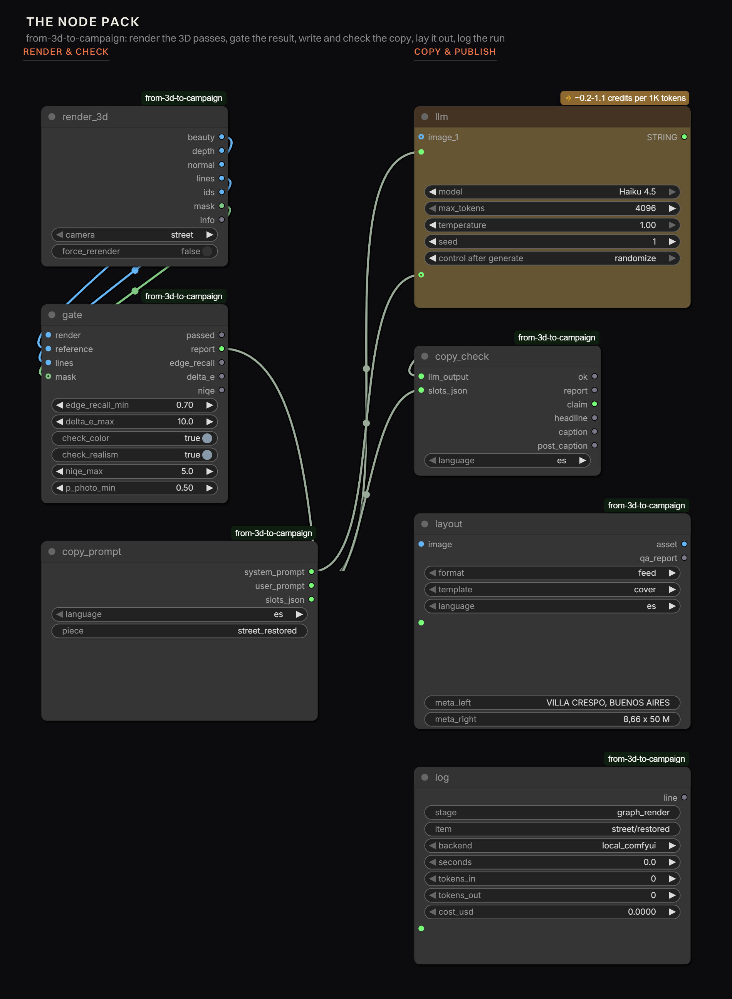

# Report notes

Working notes for the case-study page, organised the way the page will be. Every number here
comes from `out/runs.jsonl`, `docs/costs.md` or a tool response — nothing is estimated. Updated as
we go so the report doesn't have to be reconstructed at the end.

Last updated: 2026-09-20.

---

## 1. Hero / what this is

A production pipeline that turns a 3D model of a building into a library of social-ready campaign
assets — stills, copy, formats and languages — with a quality gate that protects the architecture
and a cost line for every piece. Built as ComfyUI nodes so the whole thing runs as one graph.

The developer (*form and order*) and the project (*Casa Larga 1408*) are **fictional**, invented
for this R&D. Figures are hypothetical and flagged as such in the configs.

## 2. Headline numbers (so far)

| Metric | Value | Source |
|---|---|---|
| Total spend, whole project | **$0.145** | `docs/costs.md` |
| Cost per approved piece (all R&D included) | **$0.021** | idem |
| Marginal cost of one more piece | ~$0.004 cloud GPU + ~$0.0001 local upscale | billing feed |
| Render time, cloud (FLUX.2 klein, warm) | **4.1–4.4 GPU s** per image | Comfy billing feed |
| Render time, local (SDXL + Lightning, RTX 2060 6 GB) | **63 s** per image | `runs.jsonl` |
| Ads from one approved image | 3 formats × 3 languages in **~0.3 s**, $0 | `compose_ads` |
| Full post package (7 assets × 3 languages) | **4.0 s**, $0 | `build_post` |
| Quality gate | 6 of 18 verdicts passed; 2 more approved by a human | `qa_gate` entries |

## 3. Pipeline stages

1. **3D → passes.** Beauty, depth, normals, lines and material IDs, 1216×832, ~1.6 s per camera,
   content-addressed cache. Lines come from G-buffer discontinuities (ID / depth / normal crease),
   not from Canny on the beauty, so textures and shadows never make false lines.
2. **Render.** ControlNet (local SDXL) or reference edit (cloud FLUX.2 klein), 4–8 steps.
3. **Quality gate.** Geometry, brand colour, photo-vs-CG, texture naturalness.
4. **Retry / escalate.** New seed, then prompt fix, then human review.
5. **Library.** 2× upscale (Real-ESRGAN, local, free) + crops framed on the house via the ID mask.
6. **Copy.** LLM with a constrained system prompt + automatic validation.
7. **Layout.** Design system: grid, type scale, safe zones, brand mark, AI disclosure.
8. **Log.** Seconds, tokens, credits, dollars per piece.

## 4. Technical decisions worth telling

- **Passes from geometry, not from the image.** The 3D scene knows what is a wall, a window, the
  sky. That is what lets us (a) control the render, (b) measure fidelity afterwards, and (c) place
  type on calm areas of the photo by data.
- **Lens shift instead of tilting** on the street camera: verticals stay vertical, like architectural
  photography. Depth is encoded as disparity (MiDaS convention) with a per-camera range, after the
  first version let the near asphalt eat the whole gray range.
- **6 GB VRAM is a step-count problem, not a ControlNet problem.** 30 → 20 steps: 213 s → 128 s.
  Dropping the second ControlNet saved ~20 % at 30 steps and nothing at 20. SDXL-Lightning (8 steps,
  CFG 1, so no uncond pass) took it to 63 s: 3.4× faster, same gate verdicts.
- **img2img fixes colour and breaks realism.** Denoise 0.75 from the beauty gave the best geometry
  and ΔE of the local tier, but the images read as CG (NIQE 3.5–5.8 vs ~2 for text-to-image). The
  metrics liked it; the eye didn't. That is what forced a realism metric into the gate.
- **Edit models beat ControlNet for brand colour.** FLUX.2 klein with the beauty as a reference
  carries the palette (ΔE 2.2–6.8) where ControlNet models follow the prompt instead (ΔE 15–22).
  Adding the inverted line drawing as a **second reference** raised geometry 0.75 → 0.77.
- **Same failure twice = prompt bug.** The "restored" style said *cream and ochre plaster*, which
  contradicted the brand palette. Retrying seeds burned credits on a prompt problem.
- **Design QA needs a collision check.** Contrast and safe zones pass while the price sits on top of
  the disclosure. The overlap rule caught what the numeric checks could not.

## 5. Metrics: what worked and what didn't

| Metric | Verdict |
|---|---|
| **Edge recall vs the 3D line map** | Works. Catches drift and invented openings. Reference ceiling: the beauty itself scores 0.78. |
| **ΔE after gray-world white balance** | Works with caveats: needs a coverage floor (aerial facade = 0.37 % of frame) and a looser threshold at dusk (mixed illuminants). Fails when one hue dominates the frame (patio walls at 24 %). |
| **NIQE (pyiqa)** | Best photo-vs-CG separator: beauty 9.8, img2img 3.5–5.8, klein ~2.9, SDXL ~2. |
| **CLIP zero-shot photo vs render** | Saturated (0.97–0.99 for most). Useful as a coarse filter; one false positive (Z-Image at 0.10). |
| **LAION aesthetic predictor** | Barely moves on architecture (4.8–5.8). Logged, not gated. |

## 6. Model bake-off (street camera, 2 seeds each)

| Model | Approach | GPU s | $/image | Edge recall | Note |
|---|---|---|---|---|---|
| Z-Image Turbo + Fun ControlNet Union | ControlNet, 8 steps | 3.8–8.9 | 0.004–0.009 | **0.90–0.92** | best geometry; colour follows the prompt |
| FLUX.2 klein 9B | reference edit, 4 steps | 2.7–14.3 | 0.003–0.014 | 0.72–0.77 | best materials and palette → **winner** |
| Qwen-Image + InstantX ControlNet | ControlNet, 4 steps | 2.4–13.3 | 0.002–0.013 | 0.63–0.68 | most ornate, drifts most (invented a door) |
| RealVisXL + ControlNet union | parity run | — | 0 | — | failed validation: catalogue listed a model the executor didn't have |

Cold start is the higher number in each pair; warm runs settle at ~4 GPU s.

## 7. Cost model

- Comfy Cloud: RTX 6000 Pro at **$3.49/h = 736.39 credits/h**; our warm render = 4.2 s ≈ 0.86 credits ≈ $0.004.
- Local: measured per run with nvidia-smi (power draw × time); priced at $0.10/kWh as a stand-in.
- Local vs cloud on the same work: 63 s of a 6 GB laptop GPU vs ~4 s of a 96 GB cloud GPU. Local
  stays useful as the free draft tier and for upscaling; the cloud is for the final pass.
- Cache: content-addressed on the scene spec + camera + lighting + source code; a re-run of the
  pass exporter is 3/3 cache hits in ~0 ms.

## 8. Rights and risks

- **Model licences:** RealVisXL V5 (openrail++), xinsir ControlNet Union (Apache 2.0), Real-ESRGAN
  (BSD-3), Z-Image Turbo + Fun ControlNet (Apache 2.0), FLUX.2 klein (Apache 2.0). We deliberately
  avoided 4x-UltraSharp (CC BY-NC-SA, non-commercial) and FLUX.1-dev (non-commercial) for local work.
- **Typeface:** Switzer, Fontshare free licence, commercial use allowed.
- **Brand:** the mark is drawn from code; the visual language is generic modernist. No existing
  studio's identity is reused.
- **Disclosure:** every asset carries "image generated with AI from the project's 3D model" in its
  language, stamped by the layout engine, not left to the caption.
- **Misrepresentation is the real risk in real estate.** An AI image that adds a balcony is a legal
  problem, not an aesthetic one. The geometry check is the control that prevents it, and the review
  queue is where borderline cases go.
- Copy is constrained by a fact whitelist: the validator rejects any number that is not in the
  project's data.

## 9. Open questions / limitations

- Gate thresholds are calibrated by eye on ~30 images; they need a VLM judge or human labels.
- `Load3D` gives image, mask and normals but no depth or material IDs — colour checks and ID-based
  crops need either the exporter or a depth estimator node.
- Custom nodes run on local ComfyUI; Comfy Cloud executes its own catalogue only.
- Aerial camera is the weakest: the facade is 0.37 % of the frame, so colour QA is unreliable there.

## 10. Running the whole thing as one graph (2026-09-20)

The node pack loads in ComfyUI (6 nodes under "casa accelerator") and the image half of the master
graph runs end to end locally: **50.9 s**, sampler 33 s, VRAM peak 5,850 MB of 6,144.

**Finding: lines alone are not enough control.** `Load3D` returns image, mask and normals but no
depth, so the first graph drove SDXL with a line ControlNet only. At strengths 0.6 / 0.9 / 1.0 the
model kept the facade's rhythm but **invented a second storey with a balcony** — edge recall 0.51–0.63,
all three rejected by the gate. What holds the storey count is depth (in the CLI pipeline) or the
beauty as a reference image (FLUX.2 klein in the cloud).

**Fix inside the graph:** use the beauty as the starting latent (VAEEncode → KSampler denoise 0.85)
with the line ControlNet at 0.7. Result: **edge recall 0.79–0.83, ΔE 1.9–2.4, gate PASS**, ~54 s.
The trade-off is the local tier's flatter light (NIQE 4.2–4.4 vs ~2.9 for the cloud edit model).

Reading for the report: the control signal has to constrain *volume*, not just edges. A line map is
a silhouette plus creases; without depth or an image reference, a generative model is free to read
the same lines as a taller building.

Costing the copy node: Claude Haiku 4.5 through the partner node is priced ~0–1 credit per 1K tokens;
our prompt is ~700 tokens in and ~300 out, so ≈1 credit (~$0.005) per language.

## 11. Copy with an LLM, and why the validator matters (2026-09-20)

Copy is written by Claude Haiku 4.5 through ComfyUI's partner node, with a system prompt built by
`CasaCopySpec` from the brand voice and a **fact whitelist**: "you may use these numbers and nothing
else; if a fact is not in this list, it does not exist". Slots carry character limits because they
are layout constraints.

**Run 1 (3 languages, 1.34 credits ≈ $0.006): rejected in all three.** Not the model's fault — the
prompt showed the JSON *schema* as if it were the object to return, so the model answered with the
schema and the text inside it. The validator caught it as "expected a string, got dict", plus every
character limit. Fix: show a literal example object with placeholders, and list the limits separately.

**Run 2: EN and PT passed; ES failed by 8 characters** (caption 98 vs 90). One repair call, feeding
the rejected JSON and the issue list back to the model (0.45 credits), returned an 88-character
caption: **COPY OK**.

Total for three languages with one repair: **1.79 credits ≈ $0.0085**.

Lessons for the report:
- The validator earns its place twice over: it caught a prompt bug that looked like a model bug, and
  it turns "make it shorter" into a machine-checkable contract.
- Character limits belong in the prompt *and* in the checker. Models miscount; layouts don't forgive.
- A repair call is much cheaper than a re-generation and keeps what was already approved.

Sample output (ES, after repair): claim "la casa respira con la calle" · headline "fachada original,
1890" · caption "Postigos verdes y puerta tallada. La casa chorizo mira hacia Villa Crespo desde su
reja." · cta "conocé la casa".

## 12. The graph, as one picture (2026-09-20)

Everything above runs as **one local ComfyUI graph**, 25 nodes, seven stages:

| Stage | Nodes | What happens |
|---|---|---|
| 1 · 3D scene in | `render_3d` (CasaRender3D) | renders the house from `scene/house.json` and hands the graph beauty, depth, normal, **lines** and a house mask; content-hash cached |
| 2 · Models | `ckpt` (RealVisXL V5), `lora` (SDXL-Lightning 8-step), `controlnet` (xinsir union) + `type_lines`, `upscaler` (Real-ESRGAN) | everything that is loaded once |
| 3 · Conditioning | `positive`, `negative`, `encode_beauty`, `latent`, `cn_lines` | the beauty pass is VAE-encoded as the starting latent (denoise 0.85) and the lines drive ControlNet at 0.70 |
| 4 · Sampling | `sampler`, `decode`, `preview_render` | 8 steps, cfg 1.0, euler / sgm_uniform |
| 5 · Quality gate | `gate` (CasaQAGate), `upscale`, `down_to_2x` | edge recall, ΔE after white balance, NIQE, p_photo — then 4× and back down to 2× |
| 6 · LLM copy | `copy_prompt` (CasaCopySpec), `llm` (Claude Haiku 4.5), `copy_check` (CasaCopyCheck) | system prompt with the fact whitelist, then JSON validation |
| 7 · Layout & log | `layout` (CasaLayout), `save_asset`, `log` (CasaLogRun) | the designed asset plus one line in `runs.jsonl` with seconds, tokens and cost |

The six custom nodes are the part of the pipeline that is *ours*: the rest are stock ComfyUI nodes.
They are thin on purpose — each one calls the same Python module the CLI uses, so the graph and the
batch script cannot drift apart.

A seventh node, `CasaRender3D`, renders the passes from `scene/house.json` inside the graph
(it shells out to the Playwright exporter), so a run can start from the 3D scene instead of from
pre-exported PNGs. `Load3D` was the obvious candidate for this and does not work here: it renders in
the browser frontend, so it produces nothing in a headless or queued run.

**How these figures were made** (because "take a screenshot" does not survive a 3400 px graph):
the LiteGraph canvas is exported in the browser with `canvas.toDataURL()` at report resolution with
the background layer off, POSTed to ComfyUI's `/api/userdata`, and turned into a figure by
`scripts/comfy_figure.py`, which flattens it onto the brand ink and sets the stage labels in Switzer.
No window chrome, no viewport cropping, no zoom artefacts — and it is reproducible.
